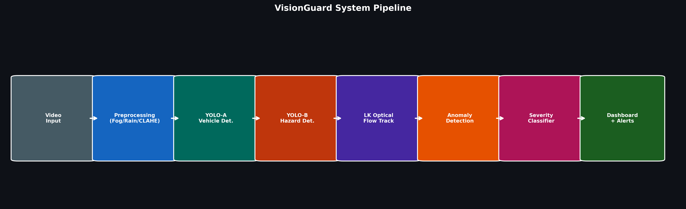
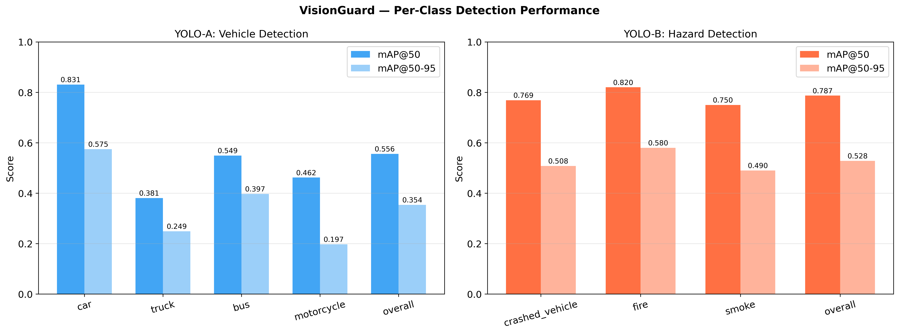
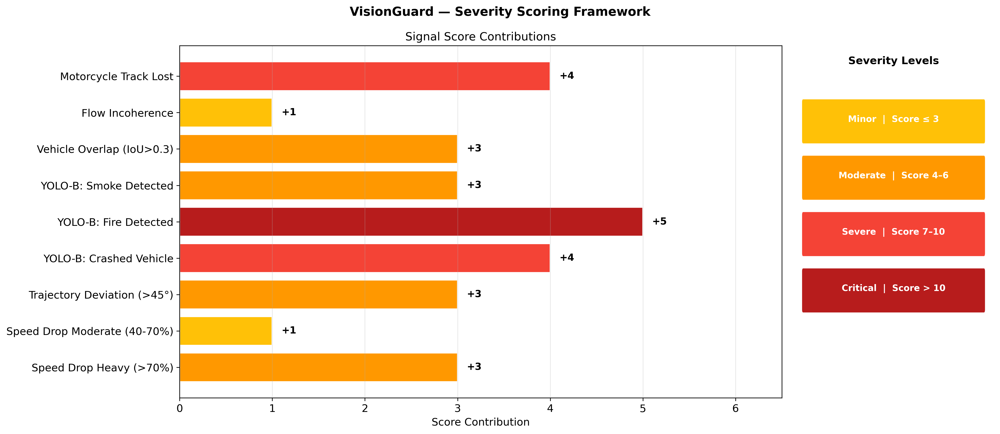

# 🚦 VisionGuard — AI-Powered Traffic Accident Detection System

<p align="center">
  
</p>

**VisionGuard** is a real-time traffic surveillance system that detects road accidents, hazards, and anomalous driving behavior from CCTV footage using deep learning and computer vision.

---

## ✨ Key Features

- **Dual YOLO Detection** — YOLO-A for vehicle detection (car, truck, bus, motorcycle) and YOLO-B for hazard detection (crashed vehicles, fire, smoke)
- **Real-Time Tracking** — ByteTrack + Lucas-Kanade optical flow for robust multi-object tracking
- **Anomaly Detection** — Multi-signal scoring system analyzing speed drops, trajectory deviations, vehicle overlaps, and flow incoherence
- **Severity Classification** — 4-tier severity system (Minor → Moderate → Severe → Critical) with configurable scoring weights
- **Adaptive Preprocessing** — Automatic fog removal (DCP), rain filtering, and CLAHE contrast enhancement
- **Telegram Alerts** — Real-time accident notifications with snapshot images via Telegram bot
- **Streamlit Dashboard** — Interactive web dashboard for monitoring and reviewing detected events
- **Pipeline Benchmarking** — Built-in tool to validate real-time performance on your hardware

---

## 🏗️ Architecture

```
VisionGuard/
├── main.py                     # Entry point — CLI interface
├── config/
│   └── config.yaml             # All tunable parameters
├── pipeline/
│   ├── engine.py               # Core pipeline orchestrator
│   └── frame_reader.py         # Threaded video frame reader
├── preprocessing/
│   ├── __init__.py             # AdaptivePreprocessor
│   ├── dehazer.py              # Dark Channel Prior fog removal
│   ├── enhancer.py             # CLAHE contrast enhancement
│   ├── motion_gate.py          # MOG2 background subtraction gate
│   └── rain_filter.py          # Temporal rain streak removal
├── detection/
│   ├── vehicle_detector.py     # YOLO-A vehicle detection
│   └── hazard_detector.py      # YOLO-B hazard detection
├── tracking/
│   └── tracker.py              # ByteTrack + LK optical flow tracker
├── anomaly/
│   └── detector.py             # Multi-signal anomaly detector
├── severity/
│   └── classifier.py           # Severity scoring & classification
├── alerts/
│   └── telegram_bot.py         # Telegram notification system
├── reporting/
│   └── logger.py               # JSON event logger
├── dashboard/
│   └── app.py                  # Streamlit web dashboard
├── graph.py                    # Research graph generator
├── test_pipeline.py            # Pipeline performance benchmark
├── models/                     # YOLO model weights (not tracked)
├── runs/                       # Training run artifacts
├── research_graphs/            # Generated analysis charts
├── output/                     # Runtime output (logs & snapshots)
└── requirements.txt            # Python dependencies
```

---

## 🚀 Getting Started

### Prerequisites

- Python 3.10+
- CUDA-compatible GPU (recommended for real-time performance)

### Installation

```bash
# Clone the repository
git clone https://github.com/YOUR_USERNAME/visionguard.git
cd visionguard

# Create virtual environment
python -m venv venv
source venv/bin/activate        # Linux/macOS
# venv\Scripts\activate         # Windows

# Install dependencies
pip install -r requirements.txt
```

### Model Weights

Download the trained YOLO model weights and place them in the `models/` directory:

| Model | File | Purpose |
|-------|------|---------|
| YOLO-A | `yoloa_best.pt` | Vehicle detection (car, truck, bus, motorcycle) |
| YOLO-B | `yolob_best.pt` | Hazard detection (crashed vehicle, fire, smoke) |

### Configuration

Edit `config/config.yaml` to customize:

- **Telegram Alerts** — Set your `bot_token` and `chat_id`
- **Detection Thresholds** — Confidence and IoU thresholds for YOLO models
- **Anomaly Parameters** — Speed drop ratios, trajectory deviation angles
- **Severity Scoring** — Signal weights and severity tier boundaries

---

## 🎬 Usage

### Run Accident Detection on a Video

```bash
python main.py --video path/to/video.mp4
```

### Options

```bash
python main.py --video input.mp4 --config config/config.yaml --log-level DEBUG --no-display
```

| Flag | Description | Default |
|------|-------------|---------|
| `--video` | Path to input video file | *required* |
| `--config` | Path to config YAML | `config/config.yaml` |
| `--log-level` | Logging level (DEBUG, INFO, WARNING, ERROR) | `INFO` |
| `--no-display` | Run headless (no GUI window) | `False` |

### Run Pipeline Benchmark

```bash
python test_pipeline.py --video path/to/video.mp4 --frames 100
```

### Launch Streamlit Dashboard

```bash
streamlit run dashboard/app.py
```

---

## 📊 Model Performance

<p align="center">
  
</p>

### YOLO-A — Vehicle Detection

| Class | mAP@50 | mAP@50-95 |
|-------|--------|-----------|
| Car | 0.831 | 0.575 |
| Truck | 0.381 | 0.249 |
| Bus | 0.549 | 0.397 |
| Motorcycle | 0.462 | 0.197 |
| **Overall** | **0.556** | **0.354** |

### YOLO-B — Hazard Detection

| Class | mAP@50 | mAP@50-95 |
|-------|--------|-----------|
| Crashed Vehicle | 0.769 | 0.508 |
| Fire | 0.820 | 0.580 |
| Smoke | 0.750 | 0.490 |
| **Overall** | **0.787** | **0.528** |

---

## 🔬 Severity Scoring Framework

<p align="center">
  
</p>

| Signal | Score |
|--------|-------|
| Speed Drop Heavy (>70%) | +3 |
| Speed Drop Moderate (40-70%) | +1 |
| Trajectory Deviation (>45°) | +3 |
| YOLO-B: Crashed Vehicle | +4 |
| YOLO-B: Fire Detected | +5 |
| YOLO-B: Smoke Detected | +3 |
| Vehicle Overlap (IoU > 0.3) | +3 |
| Flow Incoherence | +1 |
| Motorcycle Track Lost | +4 |

| Severity | Score Range |
|----------|-------------|
| 🟡 Minor | ≤ 3 |
| 🟠 Moderate | 4 – 6 |
| 🔴 Severe | 7 – 10 |
| 🚨 Critical | > 10 |

---

## 📈 Research Graphs

All analysis visualizations are in the `research_graphs/` directory:

| # | Graph | Description |
|---|-------|-------------|
| 01 | Training Curves | Loss and mAP over epochs for both models |
| 02 | mAP Comparison | Per-class detection performance |
| 03 | Severity Distribution | Incident severity breakdown |
| 04 | Signal Frequency | Which anomaly signals fire most |
| 05 | Precision-Recall | PR curves per class |
| 06 | Loss Curves | Training vs validation loss |
| 07 | Scoring Framework | Signal weights visualization |
| 08 | Dataset Distribution | Class distribution in training data |
| 09 | Pipeline Architecture | System pipeline diagram |

Regenerate graphs:
```bash
python graph.py
```

---

## 🛠️ Tech Stack

- **Object Detection** — [Ultralytics YOLOv8](https://github.com/ultralytics/ultralytics)
- **Tracking** — ByteTrack + Lucas-Kanade Optical Flow
- **Computer Vision** — OpenCV, NumPy, SciPy
- **Dashboard** — Streamlit
- **Alerts** — Telegram Bot API
- **Preprocessing** — Dark Channel Prior, CLAHE, Temporal Filtering

---
